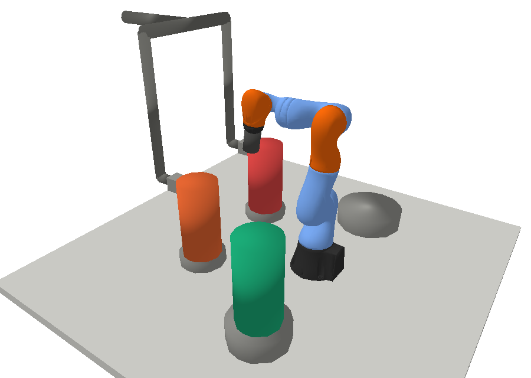
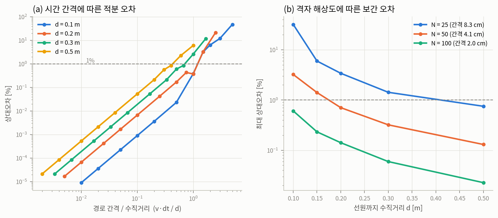
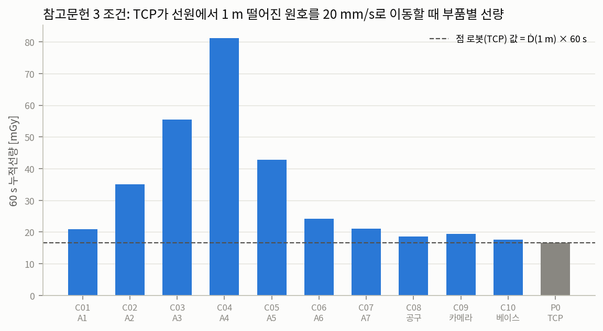
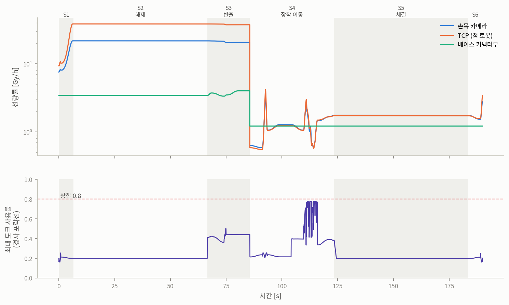
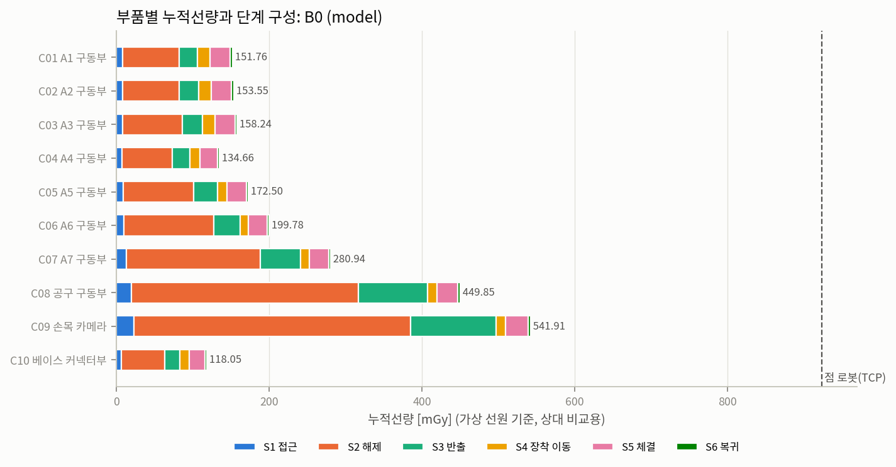
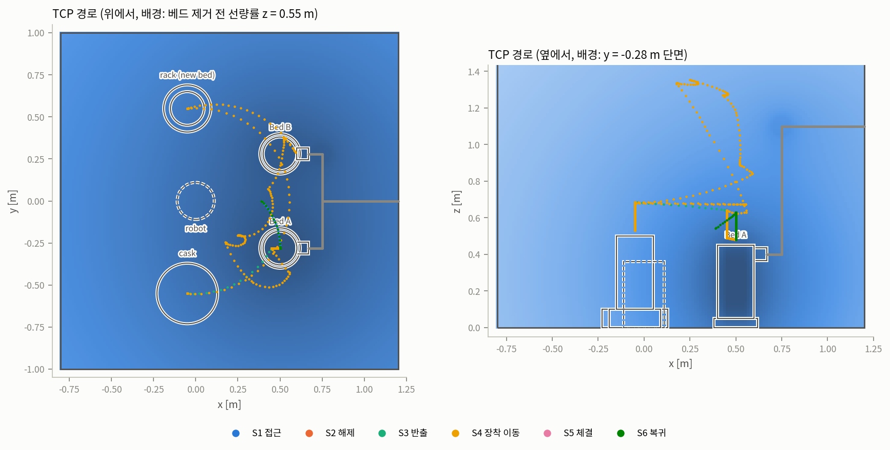
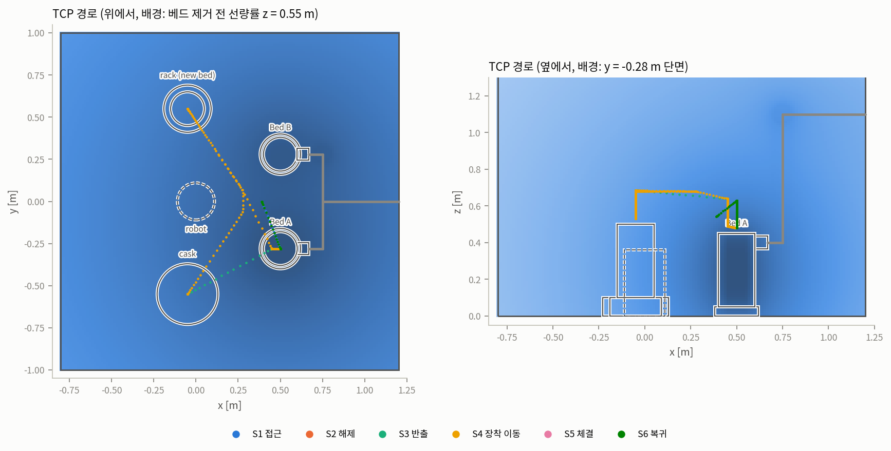
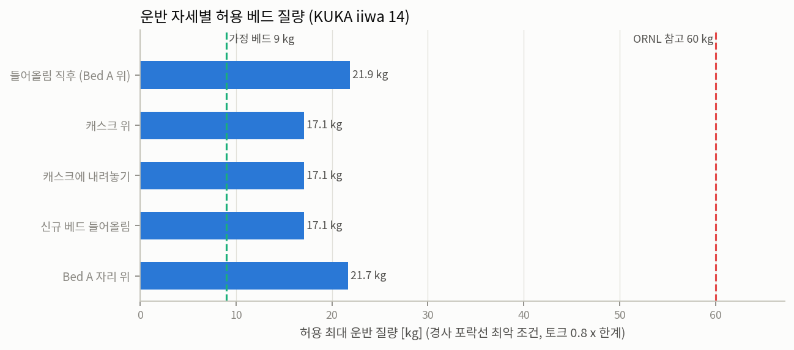

# B0·B1 기준선 결과 분석 (10/5 회의용)

작성: 백재은 (E 파트) · 2026-10-02
대상 코드: 이 폴더 (`dose-aware-traj`), 배치도 v0.1-draft, 가상 선원, 해석식 선량장(`--field model`)

선량 절대값은 가상 선원 기준이라 의미가 없습니다. 이 문서의 숫자는 **부품 사이, 단계 사이, 알고리즘 사이의 상대 비교**로만 읽어 주세요.

## 요약

1. **검증은 통과했습니다.** 시간 적분 오차는 0.1% 미만이고, 원호 기준 조건에서 TCP 선량이 해석해와 일치합니다(오차 0.000%). 격자 보간은 2 cm 간격(N=100)일 때 선원 10 cm 옆에서도 0.6% 이내입니다.
2. **선량의 75%가 체류에서, 22%가 베드 근처 직선 구간에서 나옵니다.** 경로를 고를 수 있는 계획 구간은 2~3%뿐입니다. S2 커플링 해제(60 s) 하나가 전체의 59%입니다.
3. **점 로봇(TCP) 값은 부품 선량을 대표하지 못합니다.** 교체 작업에서는 실제 최대 부품(손목 카메라 C09)보다 1.7배 크게, 원호 기준 조건에서는 A4 구동부보다 4.9배 작게 나옵니다. 오차 방향이 자세에 따라 바뀝니다.
4. **B1(TCP A*)은 B0 대비 이동 구간 선량이 2.1% 적습니다.** 계획 구간만 보면 21% 줄었지만 전체 비중이 작아서 전체로는 0.6%입니다. 이 결과는 B1 버그를 고친 뒤의 값입니다(아래 5절).
5. **가반하중은 17.1 kg까지입니다.** 경사 포락선 최악 조건에서 A6 손목 토크가 먼저 한계에 닿습니다. 가정한 9 kg 카트리지는 여유가 있고, ORNL 참고 베드(약 60 kg)는 불가능합니다.

**시사점:** 지금 가정(체류 60 s, 근접 속도 5 cm/s)에서는 경로 최적화(P1, P2)보다 **체류 자세 최적화(P3)와 근접 구간 속도**가 선량을 좌우합니다. 체류 시간과 근접 속도는 공정 파트 값으로 바꾼 뒤 다시 봐야 합니다.

---

## 0. 실행 환경과 재현성

| 항목 | 값 |
|---|---|
| 실행 환경 | macOS (Apple M4 Pro, arm64), Python 3.11.16, conda env `eph` |
| 패키지 | numpy 2.4.6, scipy 1.17.1, matplotlib 3.11.2, pybullet (conda-forge), toppra (소스 빌드), openpyxl 3.1.5 |
| 교차 확인 | Linux(x86_64)에서 같은 코드로 실행 |
| 재현성 | B0·B1 부품 선량이 두 환경에서 소수점 7자리까지 일치 (예: C09 541.9098 mGy). 토크 사용률 차이는 1e-8 수준 |

RRT 난수 시드가 고정되어 있어서 같은 코드면 같은 궤적이 나옵니다. 아래 B1 수치는 수정한 코드를 Linux에서 다시 돌린 값이며, Mac에서 다시 돌려도 같은 값이 나와야 합니다.



## 1. 검증 (스크립트 03, 04)

### 1-1. 시간 적분과 격자 보간



- **(a) 시간 적분:** 점선원 옆을 직선으로 지나갈 때, 경로 간격이 선원까지 수직거리의 0.4배 이하이면 오차가 1% 미만입니다. 실제 궤적은 100 Hz로 샘플링하고 TCP 최대 속도가 1.13 m/s라서 경로 간격이 최대 1.1 cm입니다. 이 간격이면 선원 10 cm 옆에서도 오차가 0.1% 미만이라, 적분 오차는 신경 쓰지 않아도 됩니다.
- **(b) 격자 보간 (무작위 24회 중 최대 오차):**

| 격자 | 간격 | d = 0.10 m | d = 0.15 m | d = 0.20 m | d = 0.30 m | d = 0.50 m |
|---|---|---|---|---|---|---|
| N = 25 | 8.3 cm | 32.1% | 6.0% | 3.4% | 1.4% | 0.8% |
| N = 50 | 4.1 cm | 3.2% | 1.4% | 0.7% | 0.3% | 0.1% |
| N = 100 | 2.0 cm | 0.6% | 0.2% | 0.1% | 0.1% | 0.0% |

**방사선 파트 요청:** 로봇이 선원에서 10~20 cm까지 접근하므로 격자 간격은 **2 cm 이하**가 필요합니다. 4 cm면 접근 구간에서 최대 3% 오차가 납니다.

### 1-2. 참고문헌 3 조건 재현 (원호 1 m, 20 mm/s, 60 s)



- TCP 선량은 계산값 16.66667 mGy, 해석해 Ḋ(1 m) × 60 s도 16.66667 mGy로 일치합니다.
- 같은 궤적에서 부품 선량은 TCP의 1.06~4.87배입니다. 선원에 가장 가까운 **A4 구동부가 TCP의 4.9배**를 받습니다. TCP만 보는 기존 연구 방식은 이 조건에서 팔 부품 선량을 최대 1/5로 과소평가합니다.
- 격자로 평가해도 해석해 대비 오차는 N=50에서 최대 0.15%, N=100에서 0.05%입니다.

## 2. B0 결과 (RRT-Connect + 경로 단축 + TOPP-RA)

### 2-1. 시간과 제약

| 항목 | 값 |
|---|---|
| 총 작업시간 | 189.9 s (동작 59.9 s, 체류 130 s) |
| 단계별 시간 | S1 6.5 · S2 60.0 · S3 19.1 · S4 37.8 · S5 60.0 · S6 6.5 s |
| 경사 포락선 최대 토크 사용률 | 0.776 (상한 0.8) |
| 계획 구간 최소 여유거리 | 3.1 cm (기준 2 cm) |

모든 계획 구간이 TOPP-RA로 시간 배정되었고(대체 방식 미사용), 토크 제약을 만족합니다.

### 2-2. 선량은 어디서 나오는가



부품 10개 선량 합 2,361 mGy의 구성:

| 구분 | 선량 [mGy] | 비중 |
|---|---|---|
| 체류 (S2 해제, S3 놓기, S4 파지, S5 체결) | 1,776.5 | 75.2% |
| 직선 구간 (베드 근처 5 cm/s 접근·분리·들어올림) | 513.1 | 21.7% |
| 계획 구간 (경로를 고를 수 있는 구간) | 71.7 | 3.0% |

| 단계 | S1 접근 | S2 해제 | S3 반출 | S4 장착 이동 | S5 체결 | S6 복귀 |
|---|---|---|---|---|---|---|
| 선량 [mGy] | 111.8 | 1,393.4 | 440.2 | 134.6 | 254.1 | 27.1 |
| 비중 | 4.7% | **59.0%** | 18.6% | 5.7% | 10.8% | 1.1% |

- **S2 체류 60 s 하나가 59%**입니다. 사용 후 베드가 아직 제자리에 있고, 공구가 손잡이에 붙어 있는 자세입니다.
- S2와 S3(사용 후 베드를 들고 이동)를 합치면 78%입니다. 베드를 캐스크에 넣은 뒤(타임라인 85.6 s)부터 손끝 선량률이 30분의 1 이하로 떨어집니다(그림에서 손목 카메라 약 20 → 0.6 Gy/h).
- 직선 구간 중 큰 것은 S3 들어올림(133.6 mGy)과 캐스크에 내려놓기(128.3 mGy)입니다. 둘 다 사용 후 베드를 매단 채 5 cm/s로 움직이는 구간입니다.

### 2-3. 부품별 선량



| 부품 | C01 A1 | C02 A2 | C03 A3 | C04 A4 | C05 A5 | C06 A6 | C07 A7 | C08 공구 | C09 카메라 | C10 베이스 | P0 TCP |
|---|---|---|---|---|---|---|---|---|---|---|---|
| 누적 [mGy] | 151.8 | 153.6 | 158.2 | 134.7 | 172.5 | 199.8 | 280.9 | 449.8 | **541.9** | 118.1 | 923.5 |
| 최대 선량률 [Gy/h] | 4.9 | 5.0 | 5.7 | 6.0 | 7.6 | 7.1 | 10.5 | 17.8 | 21.8 | 4.0 | 38.6 |

- 최대 부품은 **손목 카메라(C09)**, 다음이 공구 구동부(C08)입니다. 둘 다 손끝에 있어서 S2 체류 비중이 큽니다(C09 선량의 67%가 S2).
- 부품 사이 차이는 최대 4.6배(C09 vs C10)입니다.
- **TCP(점 로봇) 값 923.5 mGy는 C09보다 1.7배 큽니다.** TCP가 손잡이에 가장 가까운 점이기 때문입니다. 1-2절 원호 조건에서는 반대로 TCP가 4.9배 작았습니다. 점 로봇 가정은 과대·과소 방향이 자세에 따라 바뀌므로, 부품별 모델이 필요하다는 근거가 됩니다.
- 부품 예산 기반 지표(J_dose, 예산 사용률)는 TID_max와 N_ex가 들어와야 계산됩니다. 지금은 비어 있습니다.

### 2-4. B0의 약점: S4 "Bed A 자리로 운반"



| 계획 구간 | 시간 [s] | TCP 경로 [m] | 직선거리 [m] | 관절 이동 합 [rad] |
|---|---|---|---|---|
| S1 대기→Bed A 위 | 0.88 | 0.32 | 0.31 | 2.7 |
| S3 캐스크로 운반 | 0.95 | 0.60 | 0.57 | 2.1 |
| S4 신규 베드 위로 | 2.25 | 1.84 | 1.10 | 4.5 |
| **S4 Bed A 자리로 운반** | **6.17** | **3.15** | **0.97** | **22.2** |
| S6 대기 위치로 복귀 | 0.88 | 0.32 | 0.31 | 2.7 |

새 베드(8 kg)를 들고 가는 이 구간에서 RRT가 TCP를 z = 1.35 m까지 올리는 우회 경로를 만들었고, 경로 단축으로도 없어지지 않았습니다. 동작시간의 10%를 차지하고, 토크 사용률 최대값(0.776)도 이 구간에서 나옵니다(타임라인 110~116 s). 선량 기여는 23.9 mGy(1%)로 작습니다. 최적화하지 않은 기준선의 성격이라 그대로 두지만, B0와 비교할 때 **동작시간·토크 차이는 이 구간 하나의 영향이 크다**는 점을 감안해야 합니다.

## 3. B1 결과와 B0 비교 (TCP 3D A* + IK 추종)



| 항목 | B0 | B1 | 변화 |
|---|---|---|---|
| 총 작업시간 [s] | 189.9 | 186.1 | -3.8 s |
| 동작시간 [s] | 59.9 | 56.1 | -6.4% |
| 부품 선량 합 [mGy] | 2,361.2 | 2,346.0 | -0.6% |
| 이동 구간(S1, S3, S4, S6) 부품 선량 합 [mGy] | 713.8 | 698.6 | -2.1% |
| 계획 구간 부품 선량 합 [mGy] | 71.7 | 56.5 | -21% |
| 최대 부품 C09 [mGy] | 541.9 | 540.8 | -0.2% |
| TCP [mGy] | 923.5 | 922.6 | -0.1% |
| 최대 토크 사용률 | 0.776 | 0.679 | |
| 계획 구간 최소 여유거리 [m] | 0.031 | 0.050 | |
| 저크 적분 | 5.7e5 | 1.2e6 | 2.1배 |

- B1은 TCP 위치의 선량률만 보는데도 계획 구간 선량을 21% 줄였습니다. 하지만 계획 구간이 전체의 3%라 전체 효과는 0.6%입니다.
- 부품별로 보면 베이스 쪽(C01~C05, C10)은 1~1.5% 줄었지만 손끝(C08, C09)은 0.2~0.3%만 줄었습니다. TCP 기준 비용은 손끝이 아닌 팔 전체의 배치를 바꾸지 못합니다.
- B1이 더 빠른 이유는 대부분 B0의 S4 우회 구간(2-4절) 때문입니다.
- B1의 저크가 2배인 것은 2 cm 간격 IK 추종점의 미세한 불규칙 때문으로 보입니다. 제어 파트에 넘길 궤적은 B0 기준입니다.

## 4. 가반하중과 토크 (스크립트 08)



| 운반 자세 | 9 kg 사용률 | 60 kg 사용률 | 허용 최대 질량 |
|---|---|---|---|
| 들어올림 직후 (Bed A 위) | 0.36 (A4) | 3.32 (A6) | 21.9 kg |
| 캐스크 위 | 0.44 (A6) | 4.21 (A6) | 17.1 kg |
| 캐스크에 내려놓기 | 0.44 (A6) | 4.21 (A6) | 17.1 kg |
| 신규 베드 들어올림 | 0.44 (A6) | 4.21 (A6) | 17.1 kg |
| Bed A 자리 위 | 0.36 (A4) | 3.35 (A6) | 21.7 kg |

- 경사 7개 조건 중 최악(동적 횡동요 22.5° + 종동요 7.5°)에서 토크 0.8 × 한계 기준입니다.
- 한계는 A6 손목(40 N·m)이 먼저 닿습니다. 베드 질량중심이 TCP 아래 0.23 m에 매달려 경사 시 손목 모멘트가 커지기 때문입니다.
- 정적(준정적) 계산이라 운반 중 가속에 의한 관성 토크는 빠져 있습니다. 궤적 전체의 토크(B0 0.776)는 TOPP-RA 단계에서 가속을 포함해 계산한 값입니다.

**회의 안건:** 베드 카트리지 질량 상한을 17 kg(공구 1.5 kg 별도)으로 공정·소재 파트와 맞춰야 합니다. 차폐재를 추가하면 그 질량도 이 범위 안에 들어와야 합니다.

## 5. 이번에 고친 것

Mac 실행 결과를 검토하다가 B1 버그 하나와 그림 문제 몇 가지를 찾아 고쳤습니다.

### 5-1. B1: 랙에 도착한 뒤 팔이 로봇 주위를 한 바퀴 도는 문제

**현상 (수정 전 Mac 결과):** S4 "신규 베드 위로"에서 TCP가 93.6 s에 이미 랙에 도착했는데, 이후 2.6 s 동안 A1이 -2.0에서 +1.5 rad로 돌면서 팔 전체가 로봇 주위를 한 바퀴 돌아(z 최대 0.91 m) 같은 자리로 돌아왔습니다. 이 구간 TCP 경로가 직선거리의 3.5배(3.85 m)였습니다.

**원인과 수정 (`datraj/astar.py`):**

| 원인 | 수정 |
|---|---|
| A*가 로봇 바로 뒤(축에서 0.28 m)를 지나는 경로를 골랐는데, A1 한계(±170°) 때문에 팔이 그쪽을 정면으로 볼 수 없어 어깨를 뒤로 넘긴 자세로 바뀜 | 도달 가능 영역에서 로봇 뒤쪽 쐐기(방위각 150° 초과) 제외 |
| 도달 가능 영역을 어깨-손목 거리로만 판단해서, 공구를 아래로 향할 수 없는 칸(팔을 거의 위로 편 자세)도 포함 | 평면 팔 근사로 A2, A4, A6이 모두 한계 안에 드는 해가 있는 칸만 포함 |
| 경로 단축에서 원래 경로 비용이 무한대(끝점 반올림으로 점유 칸을 스친 경우)이면 `inf > inf`가 거짓이 되어 **어떤 단축이든 허용** | 비용이 유한한 직선만 허용하도록 비교 로직 수정 |
| 공구 yaw를 절대각으로 보간해서 A1이 크게 도는 구간에서 A7이 반대로 거의 한 바퀴 돌아야 함 | 로봇 기준 방위각에 대한 상대 yaw를 보간 |
| IK 추종 마지막 자세와 웨이포인트 자세가 다른 해여도 그대로 이어 붙임 | 영공간 기준 자세를 시작·목표의 관절 보간으로 두고, 마지막 관절 차가 0.35 rad를 넘으면 실패로 처리 |

**영향:** B1 동작시간 59.0 → 56.1 s, 이동 구간 선량 변화 -0.3% → -2.1%, 저크 1.5e6 → 1.2e6. B0 결과는 바뀌지 않습니다.

### 5-2. 그 밖의 수정

| 파일 | 내용 |
|---|---|
| `datraj/viz.py` | `06_run_b0.py --gui` 재생 중 창을 닫으면 `Not connected to physics server` 에러가 나던 문제. 창 닫기를 정상 종료로 처리 |
| `datraj/viz.py` | 경로 그림 범례가 위에서 본 그림을 가리고 잘리던 문제(아래로 이동), 옆에서 본 그림에서 z > 1.3 m 경로가 잘리던 문제 |
| `datraj/viz_style.py` | 로그축 눈금의 마이너스 기호가 깨지던 문제 (`U+2212` 경고 20줄) |
| `scripts/04_validate_arc.py` | 점선 설명 문구가 C01 막대와 겹치던 문제 (범례로 이동) |
| `handoff/03_materials/component_inputs.xlsx` | 수식 결과를 미리 계산해 저장 (Excel 없이 미리보기에서도 값이 보임) |

## 6. 한계

- **가상 선원:** 선량 절대값과 단계별 비중은 방사선 파트 격자로 바꾸면 달라집니다. 특히 S2 체류 비중(59%)은 손잡이 근처 선량률에 크게 좌우됩니다.
- **체류 시간과 근접 속도는 가정값:** 체류 선량은 체류 시간에 정비례합니다(자세가 고정이라 선량률이 일정). 예를 들어 S2, S5 체류를 60 s에서 30 s로 줄이면 부품 선량 합이 824 mGy(35%) 줄어듭니다. 직선 구간 선량도 근접 속도에 거의 반비례합니다.
- **차폐 미반영:** 투과율 S_k = 1(차폐 없음)입니다. 소재 파트 입력이 오면 부품별로 달라집니다.
- **체류 자세 고정:** S2, S5 자세는 IK 체인의 첫 해를 그대로 씁니다. 같은 TCP 자세에서 팔꿈치 위치를 바꾸는 최적화(P3)는 아직 없습니다.
- **B0 시드 하나:** RRT 결과는 시드에 따라 달라집니다. 2-4절의 우회 구간이 시드에 따라 생기거나 없어질 수 있어서, 공정한 비교를 위해 여러 시드로 돌려 평균과 분산을 봐야 합니다.
- **경사 관성력:** 준정적 근사입니다. 운반 중 동적 토크는 TOPP-RA 단계에서만 반영됩니다.
- **B1 도달 영역:** 평면 팔 근사입니다. A3, A5를 쓰면 실제로는 더 넓을 수 있습니다.

## 7. 다음 단계와 다른 파트에 필요한 값

**E 파트 (다음 2주):**
1. **P3 체류 자세 최적화** (S2, S3, S5에서 영공간으로 팔꿈치·손목 위치 변경). 선량 비중으로 보면 효과가 가장 클 후보
2. **근접 구간 선량 적응 속도 α(s)**
3. P1 dose-aware RRT*, P2 STOMP
4. B0 다중 시드 (10회 이상) 평균·분산
5. ε-제약법 Pareto front (선량 vs 시간), ablation, 강건성

**다른 파트에 요청할 값:**

| 파트 | 필요한 값 | 이유 |
|---|---|---|
| 방사선 | 베드 제거 전/후 격자, **간격 2 cm 이하** | 근접 구간 보간 오차 (1-1절) |
| 공정 | S2 해제·S5 체결 실제 소요 시간, 근접 구간 허용 속도 | 선량의 75%가 체류, 22%가 근접 구간 |
| 소재 | `component_inputs.xlsx` (부품별 TID_max, 투과율 S_k, 차폐재 질량) | J_dose 계산, 차폐 질량이 가반하중 17 kg 안에 드는지 확인 |
| 제어 | `e_track.csv` (경사 조건별 추종 오차) | 여유거리 기준 2 cm + e_track |

## 재현 방법

```bash
conda activate eph
python scripts/01_make_virtual_grids.py
python scripts/03_validate_line.py
python scripts/04_validate_arc.py
python scripts/05_solve_waypoints.py
python scripts/06_run_b0.py
python scripts/07_run_b1.py        # B0 다음에 실행해야 비교표가 만들어짐
python scripts/08_payload_check.py
python scripts/10_export_handoff.py
```

결과는 `outputs/`에 생깁니다. 이 문서의 그림은 `docs/figures/`에 복사해 둔 것입니다.
