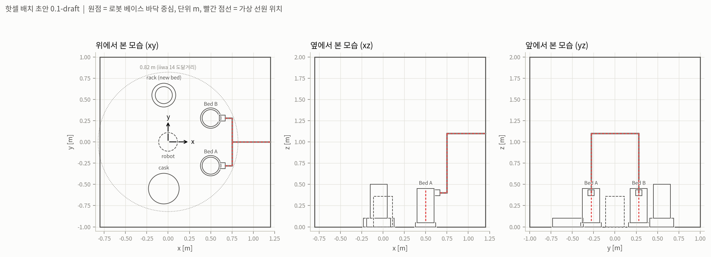

# 핫셀 좌표계와 배치 초안 v0.1 (전 파트 공통)

모든 파트가 같은 좌표계를 쓰기 위한 기준 파일입니다. 선량 격자, 차폐 위치, 궤적이 모두 이 좌표계 위에 놓입니다.

## 좌표계

- 원점: 로봇 베이스 설치면 중심 (핫셀 바닥, z = 0)
- x: 로봇에서 Bed A/B 쪽을 향하는 수평 방향
- y: x에서 반시계 방향 90도 (위에서 볼 때 왼쪽)
- z: 선체 경사 0도일 때 연직 위
- 단위: m, rad, kg, s. 선량률 Gy/h, 선량 Gy
- 선체 좌표계와 같다고 가정 (x 선수, y 좌현). 횡동요는 x축, 종동요는 y축 회전

## 배치 (초안)

| 물체 | 위치 (중심) | 크기 | 비고 |
|---|---|---|---|
| 로봇 | (0, 0, 0) | KUKA LBR iiwa 14 R820, 도달거리 0.82 m | 바닥 고정 |
| Bed A (교체 대상) | (0.50, −0.28, 0.25) | 직경 0.20, 높이 0.40 | 거치대 높이 0.05 |
| Bed B (운전 유지) | (0.50, 0.28, 0.25) | 같음 | |
| 퀵커플링 | 각 베드 +x쪽 옆면, z = 0.40 | 0.07 m 정육면체 | 해제 후 −x로 5 cm 빼야 분리 |
| 배관 | 커플링 → x = 0.75 → 위로 z = 1.10 → 헤더 → 벽 밖 | 반경 0.025~0.03 | |
| 보관 캐스크 도킹부 | (−0.05, −0.55, 0.05) | 직경 0.36, 높이 0.10 | 올려놓으면 닫혀 차폐된다고 가정 |
| 신규 베드 거치대 | (−0.05, 0.55, 0.05) | 직경 0.28, 높이 0.10 | 신규 베드는 그 위 |
| 핫셀 내부 | x −0.8~1.2, y −1.0~1.0, z 0~2.0 | | 벽 두께·재질은 별도 |

전체 수치는 `hotcell_layout.json`에 있습니다.

## 초안의 가정 (확인 필요)

1. **베드 크기**: iiwa 14의 가반하중 14 kg에 맞춰 직경 0.20 m, 높이 0.40 m, 약 9 kg의 축소 카트리지로 가정했습니다. 참고 자료의 ORNL 활성탄 베드(직경 약 0.43 m, 길이 약 0.91 m, 활성탄 50~65 kg)는 이 로봇의 가반하중과 도달거리를 모두 넘습니다. 10/5 회의에서 (1) 카트리지 크기를 줄이는 가정을 유지할지, (2) 선량·기구학은 iiwa로 계산하고 토크만 중하중 로봇 기준으로 볼지 정해야 합니다.
2. **로봇 고정**: 레일 없이 바닥 고정이라 모든 작업 위치가 베이스에서 약 0.6 m 안에 있습니다.
3. **커플링 위치**: 노즐이 베드 옆면(+x쪽)에 있고, 해제·파지는 베드 위쪽 손잡이에서 한다고 가정했습니다. 포스터 도면과 다르면 알려 주세요.

포스터 도면 치수가 확정되면 이 파일의 숫자만 바꾸고 `layout_version`을 올립니다. 선량 격자 메타데이터에도 이 버전을 적어 두어, 어떤 배치로 계산한 격자인지 추적합니다.
